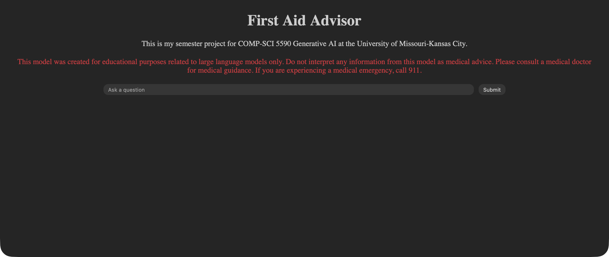

# Domain Specific Language Model Pipeline, Training from Wikipedia Category Web Scrape: First Aid Advisor

# Project Overview
This project developes and evaluates a scalable pipeline for developing a domain specific language model from scratch. The focus is not on achieving state of the art performance, but on demonstrating a scalable, end-to-end workflow for training language models from scratch on domain specific data.

    
<b>Screenshot of Deployed Model Website</b>

    

## Key Contributions
-	End-to-end pipeline: data → tokenizer → pretraining → LoRA fine-tuning → evaluation → deployment.
-	Custom tokenizer trained on domain-specific Wikipedia data.
-	GPT style language model trained from scratch.
-	Parameter-efficient fine-tuning using LoRA.
-	Evaluation across untrained, pretrained, and fine-tuned models.
-	Deployment using a Flask web server.

## Hardware Assumptions & Compute Limitations
- A GPU should be utilized to reproduce these results in a reasonable amount of time.
- Running the experiment end to end is expected to take approximately 8 - 12 hours.
- This experiment was executed using an AMD Radeon 7700 XT GPU with 12 GB VRAM in a Ubuntu environment.

# Steps to execute the project end to end
## Setup Environment
1. Open the project workspace folder in the IDE of your choice.
2. Create a Conda environment using the `environment.yml` file provided. Use the command `conda env create -f environment.yml` within the workspace folder.
3. Activate the Conda environment using the command `conda activate LLM`.

## Tokenizer Training
4. The tokenizer experiments and selection can be run by opening `/code/train_tokenizer.ipynb` and running all cells.

### Modifiable Parameters
- `vocab_sizes`: List containing all vocabulary sizes to train for the experiments.
- `min_frequency`: Number of times a token must be included in the data for it to be included in the vocabulary.

### Diagnostics & Results
- The tokenizer training script gathers the following stats for each tokenizer to find the optimal vocabulary size:
  - `average_tokens_per_article`
  - `tokens_per_1000_chars`
  - `tokens_per_word`

- The tokenizer training script generates an elbow plot showing vocab size vs tokens per word:
Elbow plot can be found at `/results/elbow_plot_tokens_per_word_vs_vocab_size.png`.

### Tokenizer Selection
- Based on the results, the desired tokenizer can be selected (vocabulary size of **24,000** was selected).
- The selected tokenizer is saved to `/code/tokenizer/` with the following files:
  - `merges.txt`
  - `tokenizer.json`
  - `vocab.json`
- A report is generated for the selected tokenizer and saved as `/results/tokenizer_report.md`.

## Pretraining Model
5. The pretraining can be run by opening `/code/train_model.ipynb` and running all cells (NOTE: This will take the longest, possibly 8+ hours).

### Key Hyperparameters
- `num_steps`: The number of steps that will be used for training.
- `val_interval`: how often to evaluate the training progress.
- `num_eval_batches`: How many batches to use per evaluation.
- `learning_rate`: Size of steps to update parameters.

### Results & Reporting
- A plot showing the training and validation loss will be saved as `/results/loss_plot.png`.
- A table showing training and validation loss will be saved as `/results/loss_report.md`.
- The best model will be saved to `/code/model/model_weights/pretrained_model_weights.pth` at each eval. When a better model is found, it will overwrite the previous best model.
- Training checkpoints will be saved to `/code/pretraining_checkpoints/` at each eval.

## LoRA Fine-Tuning Model
6. The fine-tuning can be run by opening `/code/lora_fine_tune_model.ipynb` and running all cells.

### Key Hyperparameters
- `r`: Size of added low rank update.
- `alpha`: Strength of update.
- `dropout`: Regularization to randomly drop during training.
- `targets`: Layers to apply LoRA to.

### Results & Reporting
- A table showing LoRA training and validation loss will be saved as `/results/lora_training_history_table.md`.
- A table showing LoRA adapter and model information loss will be saved as `/results/lora_training_info_table.md`.
- The best model will be saved to `/code/model/model_weights/sft_lora_adapter`.
- Training checkpoints will be saved to `/code/lora_fine_tuning_checkpoints/` at each eval.

## Evaluation
7. The evaluation notebook can be run by opening `/code/evaluation.ipynb` and running all cells.

- This notebook will load the three models:
  - Untrained model
  - Pretrained model
  - Fine-tuned model

- Each model will be evaluated on the same held out set of test prompts. We will generate responses for each model and calculate **loss** and **perplexity**. The **average loss and perplexity** will be calculated for each model across the test prompts.

- Human qualitative evaluation was also performed by a trained evaluator. Each test prompt was rated on a scale of 1 to 5 with 1 being the worst and 5 being the best. The evaluation covered the following categories:
  - **Coherence**: Logical and easy to follow
  - **Fluency**: Correct grammar and natural
  - **Repetition**: Avoids repeating itself
  - **Clarity**: Clear and easy to understand steps or advice
  - **Relevance**: Model stays on topic

### Results & Reporting
- A table showing evaluation metrics loss and perplexity for each test prompt as well as averages across all test prompts will be saved as `/results/evaluation_metrics_table.md`.
- A table showing generated prompts for each model version will be saved as `/results/evaluation_prompts_table.md`.

## Deployment
The fine-tuned model can be deployed and used in inference using the custom built Flask web server for interface.

8. Run Flask web server by running the script `/code/run_server.py`.
9. Open your browser and navigate to localhost [http://127.0.0.1:5000](http://127.0.0.1:5000).
- If connecting to the server from a different machine than what it is being hosted on, use: `http://server-ip:5000`
10. Enter your prompt into the space provided and click the `Submit` button. The model will generate a response and display it in a chat style inference.
